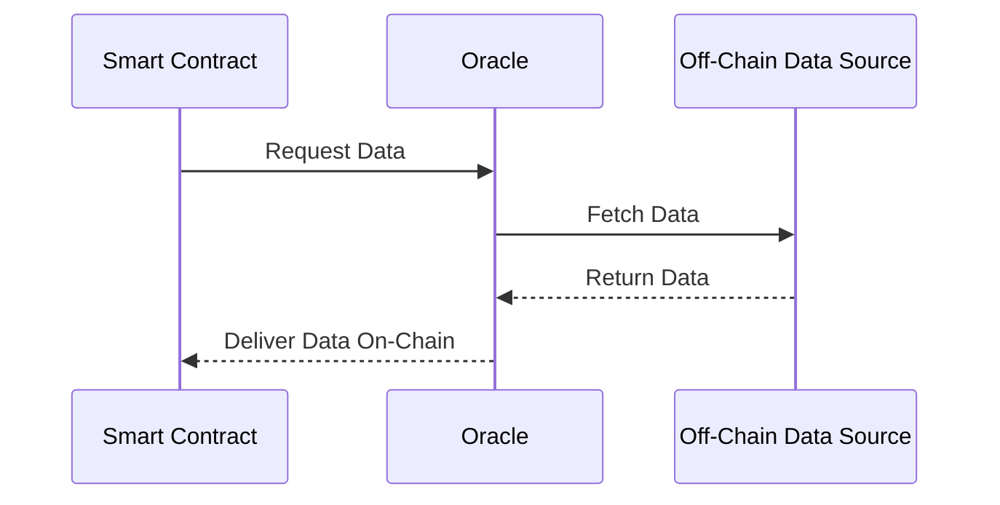
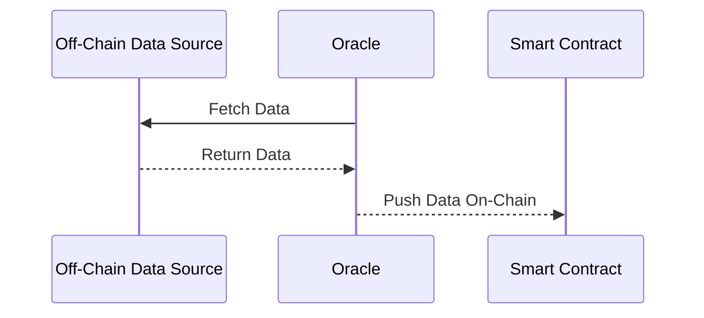
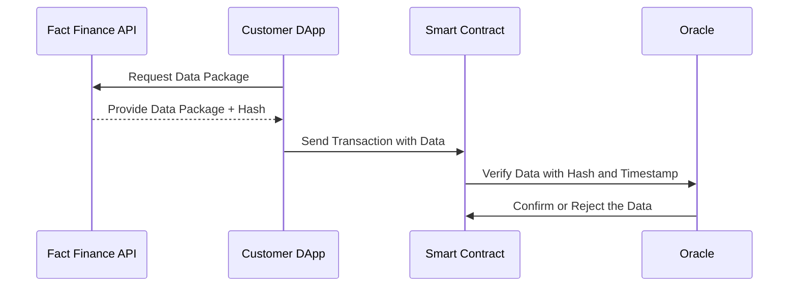

# Oracle Types

Oracles are a critical component of blockchain ecosystems, serving as a bridge between off-chain data and on-chain smart contracts. The different oracle types determine how data is delivered to decentralized applications (DApps) and how interactions are initiated. Fact Finance provides support for various oracle models tailored to specific use cases and customer needs. Here are three primary types:

## Pull Oracles
In a pull oracle system, the customer (e.g., a smart contract or DApp) initiates the request for data. The smart contract sends a query to the oracle, which then fetches the required data from off-chain sources and delivers it on-chain.

**Workflow**
1. The smart contract sends a request for specific data.
2. The oracle queries the off-chain source (e.g., APIs, databases).
3. The data is fetched, validated, and written to the blockchain for the smart contract to consume.

### Use Case Examples:
- Prediction Markets: A DApp requests the outcome of an event (e.g., a sports game or election result).
- Insurance Claims: Smart contracts pull weather or disaster data to automate payouts.

### Advantages:
- Reduces unnecessary data transmission.
- Ensures that data is fetched only when required.

### Limitations:
- Higher latency since each data fetch is initiated on-demand.
- Slightly higher gas costs due to query initialization.

## Push Oracles
Push oracles operate on a proactive model where the oracle continuously sends updated data to the blockchain without requiring explicit requests from the smart contract. This system is typically used for real-time or time-sensitive applications.

### Workflow:
1. The oracle regularly monitors off-chain sources for updates.
2. Data is validated and automatically pushed on-chain at predetermined intervals.

### Use Case Examples:
- Decentralized Exchanges (DEXs): Regularly updated price feeds for trading pairs.
- Stablecoins: Real-time price updates for pegged assets to maintain the peg.

### Advantages:
- Provides real-time data updates.
- Reduces query overhead for DApps.

### Limitations:
- Continuous data updates increase on-chain storage and gas costs.
- Requires high-frequency monitoring.

## DApp Oracles (Hybrid Model)
The DApp Oracle is a hybrid model that combines the best features of push and pull systems. In this model, the customer’s DApp requests data directly from the Fact Finance API service, which provides the data in a signed package. The data feed includes a cryptographic hash that the oracle confirms on-chain, ensuring data integrity and accuracy.

### Workflow:
1. The customer’s DApp requests a data package from the Fact Finance API.
2. The API responds with the requested data and a signed hash for integrity verification.
3. The oracle publishes the hash on-chain for the DApp to validate against the data package.

### Key Security Mechanism:
The hash verification ensures that the data provided by the API has not been tampered with. Only when the hash matches can the DApp trust the data.

### Use Case Examples:
- Tokenization Platforms: Verifying real-world asset data (e.g., property values or gold reserves) on-chain after retrieving it from the Fact Finance API.
- Lending Protocols: Requesting interest rates or collateral valuation data in near real-time with built-in hash confirmation.
- Stablecoins: Fetching foreign exchange rates for fiat-pegged tokens with on-chain integrity checks.

### Advantages:
- Combines the on-demand nature of pull oracles with the security of on-chain verification.
- Reduces unnecessary gas costs compared to continuous push updates.
- High level of trust and integrity with hash-based validation.

### Limitations:
- Relies on API availability for timely data delivery.
- Initial integration requires slightly more complexity compared to traditional models.

## Comparison Table

Oracle Type | Data Request Initiation | Frequency | Use Cases | Key Advantage
---|---
**Pull** | Smart contract initiates | On-demand | Prediction markets, insurance claims | Data fetched only when needed
**Push** | Oracle initiates | Continuous/real-time | DEX price feeds, stablecoin pegging | Real-time updates
**DApp** | Customer DApp + API | On-demand + Verified | Tokenization, lending, stablecoins | API flexibility with on-chain trust

## Why Fact Finance Supports Multiple Models

The diversity of oracle types allows Fact Finance to serve a broad range of protocols, from high-frequency trading systems to cost-sensitive applications. The DApp Oracle model, in particular, empowers customers to request data efficiently while ensuring its integrity on-chain. These flexible solutions provide the foundation for secure and scalable blockchain ecosystems.
