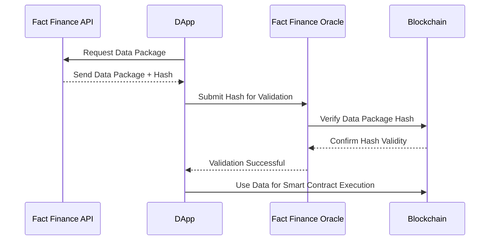
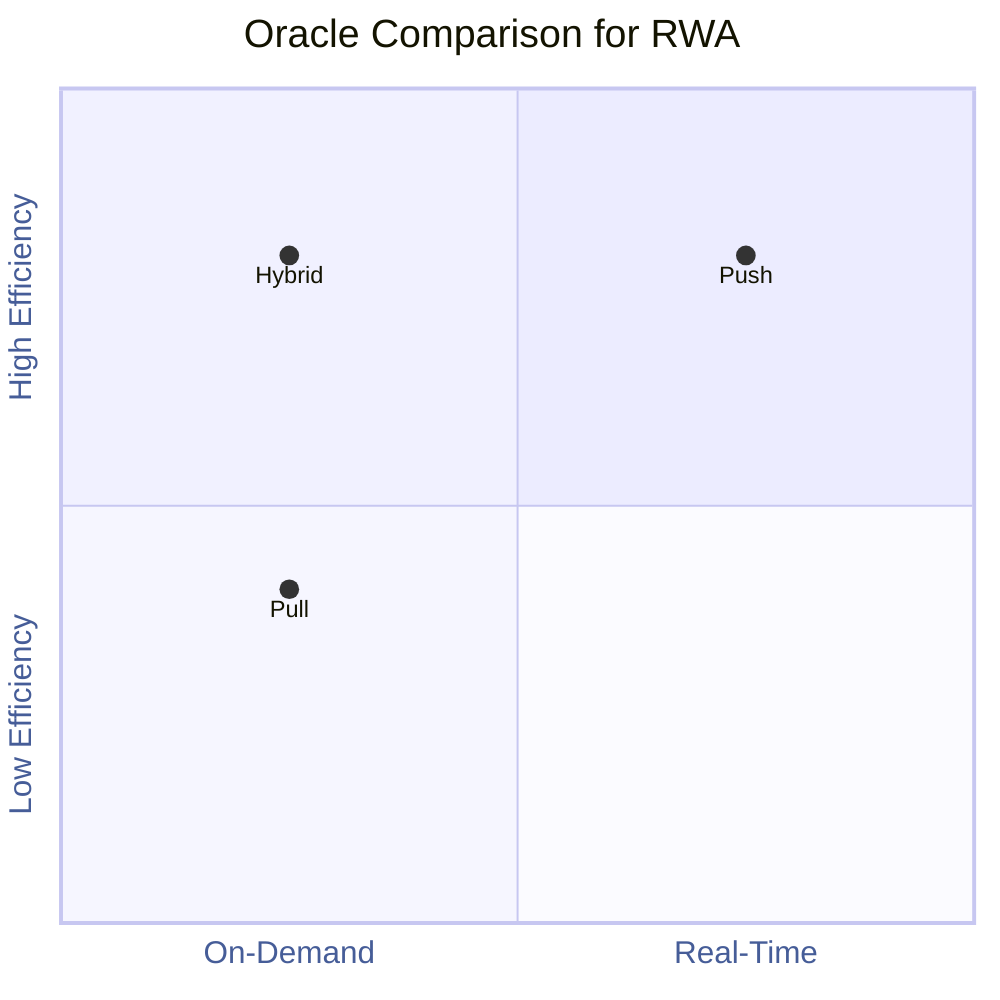

# DApp Oracle

The DApp Oracle is the alpha version of our innovative hybrid oracle model, designed to combine the flexibility of off-chain APIs with the security of on-chain verification. This experimental solution empowers decentralized applications (DApps) to seamlessly request, validate, and integrate external data with an unparalleled level of efficiency and trust.

## How It Works

The DApp Oracle operates in a two-step process, ensuring both speed and integrity:

### 1.Off-Chain Data Delivery:
- The DApp requests a data package directly from the Fact Finance API.
- The data package includes the required values alongside a unique cryptographic hash for verification.
### 2.On-Chain Validation:
- The DApp submits the data package hash to the Fact Finance Oracle, which validates the signature and integrity of the data.
- If the hash matches, the data is approved and becomes accessible for smart contract execution.

This approach combines the responsiveness of API-based off-chain delivery with the trust and immutability of on-chain validation.

## Key Features of the DApp Oracle
- Efficiency: Reduces latency by leveraging APIs for faster data retrieval.
- On-Chain Verification: Cryptographic validation ensures the authenticity and integrity of the data.
- Customizable Integration: DApps can request specific data packages tailored to their needs.
- Secure Hybrid Model: Combines off-chain flexibility with on-chain security for seamless adoption.

## Use Cases for DApp Oracle
==- Stablecoins:
Fast retrieval of FX rates and economic data with on-chain validation to maintain pegging mechanisms.
==- Lending Protocols:
Customizable data feeds for interest rates, collateral valuation, and risk management with verified accuracy.
==- Tokenization Platforms:
Secure delivery of off-chain real-world asset (RWA) data, validated before it impacts on-chain tokenized values.
==- Prediction Markets:
Fetch event data quickly and ensure on-chain verification for market outcomes.
==- DeFi Insurance:
Deliver reliable off-chain event triggers (e.g., weather data, disasters) for insurance claims with on-chain validation.

===

## Comparing Oracle Models: Hybrid vs. Push vs. Pull

Oracles play a critical role in bridging real-world data with blockchain systems, but not all oracles operate the same way. Fact Finance supports three primary oracle models—Hybrid (DApp Oracle), Push, and Pull—each tailored for different use cases and requirements.

## Be Part of the Pilot Phase

The DApp Oracle is currently in its alpha stage, and we are actively seeking partners to participate in the pilot phase. By joining the pilot, you’ll gain:
- Early access to our hybrid oracle model.
- Tailored support and integration assistance.
- The opportunity to influence the final product based on real-world testing and feedback.

Apply now to be part of our pilot phase and help shape the future of secure, efficient oracle solutions! Contact us today to learn more.

Projects Team project@fact.finance
