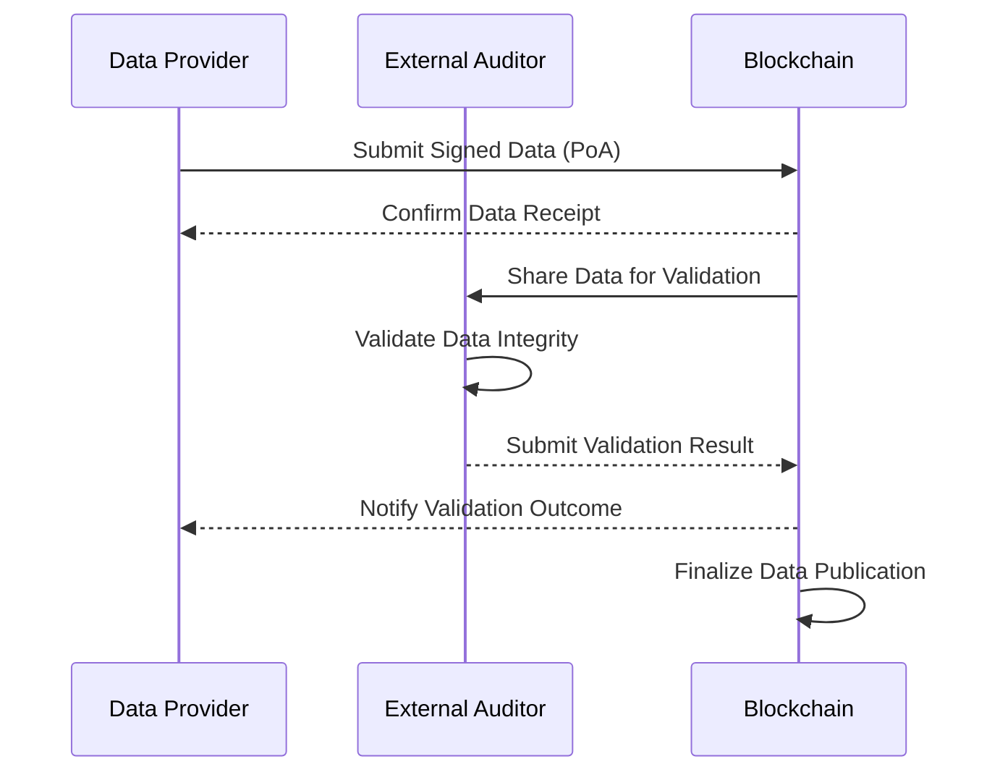

# External Auditors

The External Auditors module is a unique and exclusive feature developed by Fact Finance to extend and reinforce the security of protocols utilizing our oracle services. While the Proof of Authenticity (PoA) mechanism ensures the origin of the data, the External Auditors module validates the integrity and accuracy of the information provided.

### How It Works

The External Auditors module enables an additional layer of verification for data delivered by the oracle, ensuring protocols operate with trustworthy, validated information. This validation process can be executed through one of the following approaches:

### 1. Consensus Model:
Data validation is performed through a consensus mechanism, where multiple participants, such as clients or nodes, collectively verify the accuracy of the information.
>Example: A pool of oracle users votes on whether the data provided aligns with real-world conditions.

### 2. Specialized Auditing Firms:
Independent and trusted audit firms verify the integrity of data feeds. This ensures that external, specialized oversight adds credibility and compliance to critical data points.
>Example: Financial data validated by auditing firms to ensure accuracy for lending protocols or tokenized assets.

### 3. Machine Learning Models (ML) and Predictive Analysis:
Leveraging advanced machine learning (ML) and predictive models, data integrity is validated through contextual analysis and economic relationships.
>Example: The relationship between interest rates, foreign exchange (forex), and inflation is analyzed to detect anomalies or inconsistencies in the data.

## Why External Auditors Matter
- Enhanced Security: Ensures the reliability of data, reducing the risk of inaccuracies and manipulation.
- Layered Validation: Combines PoA for origin verification with integrity checks for robust security.
- Flexible Approaches: Provides protocols with the flexibility to choose the most appropriate validation method (consensus, auditors, or ML models).
- Risk Mitigation: Detects inconsistencies by correlating economic indicators, ensuring the data aligns with broader market behavior.

### Become an Auditor

The External Auditors module empowers protocols with an unmatched level of trust and security, making Fact Finance oracles a cornerstone for reliable decision-making in decentralized applications.

Interested in exploring how this module can enhance your project’s data integrity? Get in touch with our team to learn more!
R&D Team projects@fact.finance
