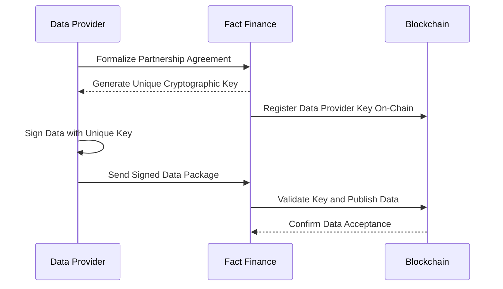

# Data Authenticity

At Fact Finance, we prioritize the integrity and reliability of proprietary data through our Data Authenticity mechanism. This feature ensures that data distributed to the blockchain originates from trusted and verified providers, enabling decentralized applications (DApps) to operate with confidence and precision.

## How It Works

### 1. Licensing and Partnerships:

Fact Finance establishes licensing agreements with renowned and reputable data providers, including:
- Research Institutes
- Specialized Data Companies
- Government Agencies

### 2. Partner Verification and Audit:

Before integration, Fact Finance conducts a thorough audit and verification of the data provider. This process ensures compliance with strict security, accuracy, and operational standards.

### 3. Cryptographic Security:

A unique cryptographic key is generated for each verified data provider. This key serves as the signature of authenticity for all data submitted to the blockchain.

### 4. Data Signing and Validation:
- Every data point sent to the blockchain must be digitally signed by the data provider using its unique cryptographic key.
- The Fact Finance Oracle validates this signature to ensure the data’s authenticity.
- Only after verification is the data accepted and published on-chain.

## New Data Providers 

Want to make your data available on the blockchain through the Fact Finance Oracle?
Contact our team of specialists to evaluate market opportunities, pricing models, and strategies for distributing your data to the growing Web3 ecosystem.

Data Team data@fact.finance
