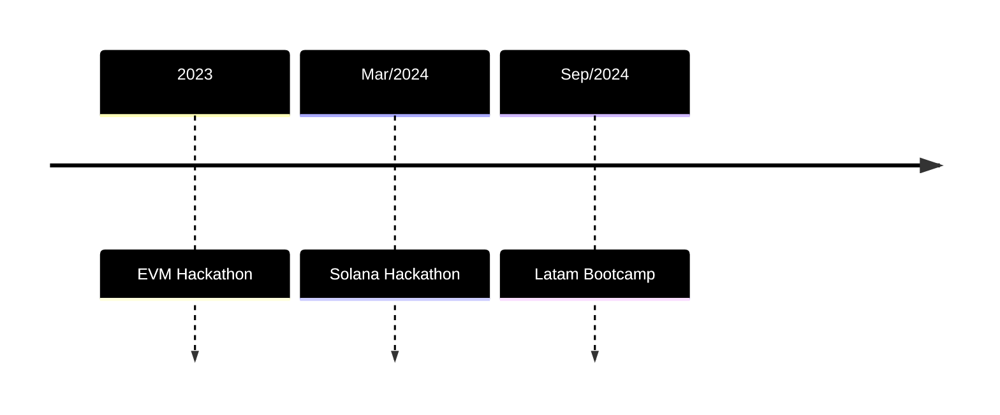

# [Fact Finance Oracle]()

Fact Finance Oracle is a cutting-edge platform connecting official data providers with the tokenized economy. We deliver secure, standardized, and verifiable data solutions, unlocking new possibilities for real-world assets in blockchain ecosystems.

Our vision is to accelerate blockchain adoption by bridging the gap between decentralized systems and the off-chain world. As the tokenization era evolves and demands for diverse, standardized data grow, Fact Finance aims to be the go-to data hub, empowering the industry with seamless access to reliable information.

## Core Solutions

### 1. Freemium Oracles
- Free access to essential economic indices (e.g., interest rates, exchange rates, inflation) from public data sources.
>Premium services for tailored data solutions for Data Providers and DeFi projects, like Proof of Reserve services.

### 2. Developer-Friendly Integration
- Comprehensive APIs and SDKs for quick and easy integration into DeFi protocols.
- Focused on supporting developers as the key drivers of blockchain innovation.

### 3. Multi-Chain Compatibility
- Designed for EVM-based blockchains and Solana, with ongoing expansion to other ecosystems.

---

## :icon-trophy: **Our Journey** 

Outlier Ventures 
:	Acceleration program cohort 

Solana Fundation 
:	First place at Renaissance Brazilian Edition. 

Brazlian Central Bank: 
:	Winner of the Best Oracle for Public Debt Award.

Khiza Dao 
:	Strategic Partnership. 

---

## :icon-webhook: Join Us
Fact Finance Oracle operates as a fully remote organization, bringing together innovative thinkers who are passionate about the future of decentralized finance and real-world asset integration.  

Explore our projects, contribute to our ecosystem, or partner with us to shape the future of DeFi.  

